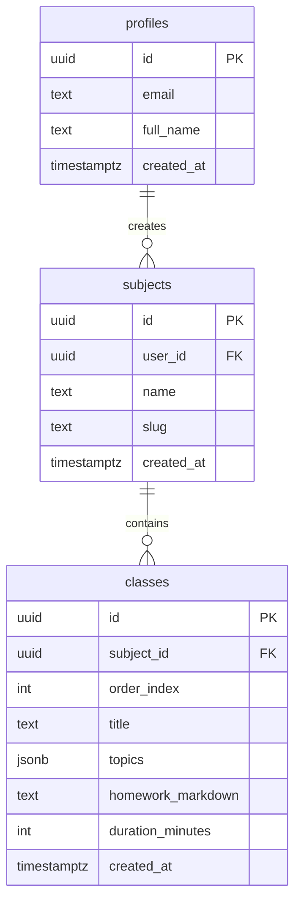

Aura Learning Platform - Backend Dev 1 Blueprint

This document serves as the architectural blueprint for Backend Dev 1 only. Features 8 (Live Voice Class) and 9 (Social Hub) are excluded.


## 0. MVP Features (Scope – Backend Dev 1 Only)

| Feature | In Scope | Notes |
|---------|----------|-------|
| 1. Auth (Supabase) | Yes | Profiles table, trigger, auth helpers |
| 2. Add Subject | Yes | Backend: /api/syllabus |
| 3. Syllabus AI Generation | Yes | Backend Dev 1 |
| 4. Classroom Hub | No | Frontend – consumes Backend 1 data |
| 5. Subject Detail Roadmap | No | Frontend – consumes Backend 1 data |
| 6. Homework AI Generation | No | Backend Dev 2 |
| 7. Active Class Page | No | Frontend |
| **8. Live Voice Class** | **No** | **Excluded – stop point** |
| **9. Social Hub** | **No** | **Excluded – stop point** |

## 1. Database Schema (Supabase)

### Tables Overview (Simplified - No ProgressState)



### Table Definitions

**profiles**

| Column | Type | Constraints |
|--------|------|-------------|
| id | uuid | PK, FK to auth.users.id |
| email | text | NOT NULL |
| full_name | text | |
| created_at | timestamptz | default now() |

**subjects**

| Column | Type | Constraints |
|--------|------|-------------|
| id | uuid | PK, default gen_random_uuid() |
| user_id | uuid | FK to profiles.id, NOT NULL |
| name | text | NOT NULL |
| slug | text | UNIQUE per user |
| created_at | timestamptz | default now() |

**classes**

| Column | Type | Constraints |
|--------|------|-------------|
| id | uuid | PK, default gen_random_uuid() |
| subject_id | uuid | FK to subjects.id, ON DELETE CASCADE |
| order_index | int | NOT NULL |
| title | text | NOT NULL |
| topics | jsonb | Array of strings |
| homework_markdown | text | Nullable until generated |
| duration_minutes | int | Default 80 |
| created_at | timestamptz | default now() |

RLS: Users only access their own subjects and related classes.

## 2. Application Architecture (Backend Dev 1 Scope)

### App Router Folder Structure

```
app/
├── layout.tsx
├── page.tsx
├── api/
│   └── syllabus/route.ts      # Backend Dev 1
└── globals.css
```

**Out of scope for Backend Dev 1:** Frontend routes (auth, dashboard, classroom) and /api/homework.

## 3. AI Generation (Vercel AI SDK)

Dependencies: ai, @ai-sdk/openai, zod

All LLM calls use Vercel AI SDK (no direct OpenAI REST calls).

### Syllabus Generation (/api/syllabus/route.ts)

Use generateText from ai with openai from @ai-sdk/openai. For structured JSON, use the AI SDK Output API with Zod schema.

Prompt: Break down subjectName into an 80-min-per-class syllabus. Each class: 5-8 topics, foundational to advanced. Output schema: { classes: [{ order_index, title, topics, duration_minutes: 80 }] }.

Flow: POST with { subjectName } → generate → insert subjects + classes in Supabase → return subject ID.

## 4. Implementation (Backend Dev 1 Only)

| Phase | Tasks |
|-------|-------|
| **Phase 1** | Supabase migration: profiles, subjects, classes; RLS; profile trigger |
| **Phase 2** | lib/supabase: client, server, auth helpers, subject/class fetch helpers |
| **Phase 3** | /api/syllabus: Vercel AI SDK generateText + structured output; insert into Supabase |
| **Phase 4** | Error handling, env setup, README |

**Explicitly excluded:**
- Feature 8: OpenAI Realtime API, WebRTC, live voice
- Feature 9: Social Hub (mocked or real)

## 5. File Reference Summary (Backend Dev 1)

| File | Purpose |
|------|---------|
| supabase/migrations/001_initial_schema.sql | Schema + RLS |
| lib/supabase/client.ts | Browser client |
| lib/supabase/server.ts | Server client |
| lib/supabase/auth.ts | getCurrentUser |
| lib/supabase/subjects.ts | getSubjects, getSubjectById, getClassesBySubjectId |
| lib/supabase/index.ts | Re-exports |
| app/api/syllabus/route.ts | Syllabus generation API |

## 6. Implementation Stop Points

- **Do not implement** Feature 8 (Live Voice Class): No WebRTC, no OpenAI Realtime API integration.
- **Do not implement** Feature 9 (Social Hub): No Social Hub UI, sidebar, or dummy data.
